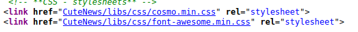
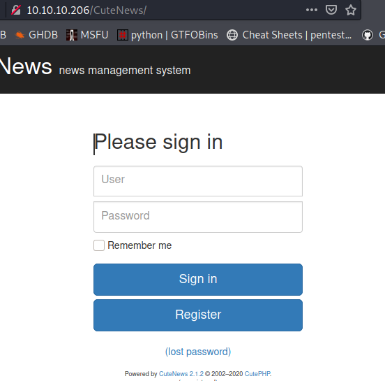
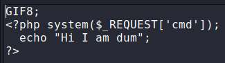
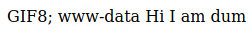
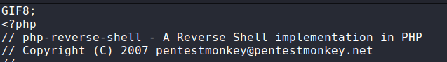
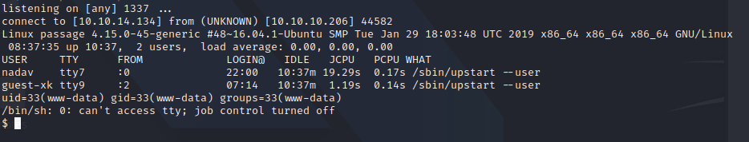
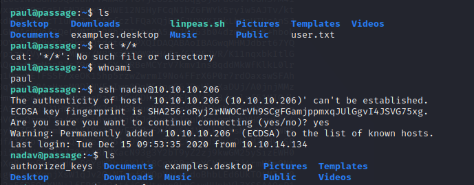
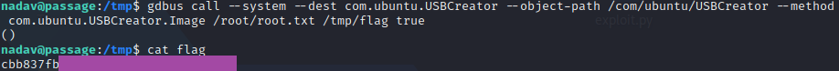

# HTB - Passage

## HTB - Passage

* OS: Linux
* IP: 10.10.10.198


### Overview

Passage is a medium difficulty Linux box. The initial foothold is a misconfiguration in the way that CuteNews handles profile avatars. By changing the magic byte of a file we can upload any file we want since CuteNews only verify the file by the magic byte and not by file extensions as well. That way we have access as a low privileged user. Going through the CuteNew's configuration files we see a directory `cdata/users` which contains some `php` scripts with `base64` encoded strings. Decoding those we have potential users and their hashed passwords, among them is the user `paul` whose password is crackable, also paul is a user account in the machine. In paul's home directory we have a `ssh private key` which works for `nadav` \(second user on the box\) as well, for some reason the share the same ssh key and finally by exploiting a vulnerability in USBCreator we can elevate our privileges to root.

### Useful Tools

1. pyspy [https://github.com/DominicBreuker/pspy](https://github.com/DominicBreuker/pspy)

## Enumeration

### Nmap

```bash
PORT   STATE SERVICE REASON         VERSION
22/tcp open  ssh     syn-ack ttl 63 OpenSSH 7.2p2 Ubuntu 4 (Ubuntu Linux; protocol 2.0)
| ssh-hostkey:
|   2048 17:eb:9e:23:ea:23:b6:b1:bc:c6:4f:db:98:d3:d4:a1 (RSA)
|   256 71:64:51:50:c3:7f:18:47:03:98:3e:5e:b8:10:19:fc (ECDSA)
|_  256 fd:56:2a:f8:d0:60:a7:f1:a0:a1:47:a4:38:d6:a8:a1 (ED25519)
80/tcp open  http    syn-ack ttl 63 Apache httpd 2.4.18 ((Ubuntu))
| http-methods:
|_  Supported Methods: GET HEAD POST OPTIONS
|_http-server-header: Apache/2.4.18 (Ubuntu)
|_http-title: Passage News
```

### Site discovery

After the initial enumeration we can see that on the machine run's a web server and port 22 \(ssh\) is open. Visiting the website we don't get much but we see a post about `fail2ban` so we can't just user `gobuster` for directory searching. Low hanging fruits such as `robots.txt, admin.php/html, cgi-bin` gave us nothing.

 

Taking a look at the source of the webpage we can see a odd directory `CuteNews`.



Visiting `http://10.10.10.206/CuteNews` we get a login screen for CuteNews which something like a CMS for news posting, and the version `CuteNews 2.1.2`



## Getting RCE

Since we know the version and the software that is used on the site we can search for vulnerabilities and right away we can find a python script in `exploitdb` which creates a user uploads a file as avatar by changing the magic byte so that CuteNews recognizes it a `GIF` and creates a reverse shell. But we will do it the manual way.

> Script can be found here: [https://www.exploit-db.com/exploits/48800](https://www.exploit-db.com/exploits/48800)

So we create a user on CuteNews and we can upload our avatar on our profile. For proof of concept we create a generic `php reverse shell` save it as a `.php` but in the script at the top we put the `GIF8` magic byte.



We can call the shell from the url parameter ot verify code execution on the box. `http://10.10.10.206/CuteNews/uploads/avatar_dum_avatar_newdev.php?cmd=whoami`



So now we can upload a `php reverse shell` open a `netcat` listener and get a reverse shell.





## Privilege escalation

### Escalating from low privileged user to user paul

Looking through the CuteNews configuration files on the server I found an interesting directory `../cdata/users` which contained some `.php` scripts with base64 hashes. By decoding those hashes we have the registered users on CuteNews CuteNews and their hashed passwords. One of those users is paul who is a user account on the server as well `paul: e26f3e86d1f8108120723ebe690e5d3d61628f4130076ec6cb43f16f497273cd` Using hashcat we can crack the pauls password and we can su as him.

```text
hashcat -m 1400 hash /usr/share/wordlists/rockyou.txt --user

paul:atlanta1
```

* At this point we can get the user flag in `user.txt` on the home directory of paul

### Escalating from user paul  to user nadav

Taking a look in pauls home directory we can see a `ssh private key` and in the `authorized_keys` we have `nadavs` public key so `nadav` is authenticated in the server and we can ssh from paul to nadav `ssh nadav@10.10.10.206`. Using the `private ssh key` that we found also works for nadav.



### Escalating from user nadav  to root

Doing some manual enumeration on the nadav user I found a `.viminfo` that contains `vim markers` which indicate that the last modified file is `/etc/dbus-1/system.d/com.ubuntu.USBCreator.conf`. Looking at this file we can see the access policy for `USBCreator`is set to root and anyone can invoke methods with root privileges. According to an article that I found online if USBCreator access policy is set to `root` and `dbus` is running on the system we can read and write files as root by invoking privileged methods from USBCreator.

> [USBCreator vulnerability](https://unit42.paloaltonetworks.com/usbcreator-d-bus-privilege-escalation-in-ubuntu-desktop/)

#### Verifying dbus is running on the server

I found that dbus is running by accident when I was doing the enumeration. I used `pspy` to monitor running processes and one of them was `dbus` so now we can just use the POC from the article and grab the root flag.

#### Exploiting USBCreator

```bash
gdbus call --system --dest com.ubuntu.USBCreator --object-path /com/ubuntu/USBCreator --method com.ubuntu.USBCreator.Image /root/root.txt /tmp/flag true
```



Since we can read the flag we can use the same command to steal roots id\_rsa if that exists and the ssh in the server as root.

```bash
gdbus call --system --dest com.ubuntu.USBCreator --object-path /com/ubuntu/USBCreator --method com.ubuntu.USBCreator.Image /root/.ssh/id_rsa /tmp/pwn true
```

Roots id\_rsa exists and we can login as root on the box but I will not include that part for obvious reasons.

