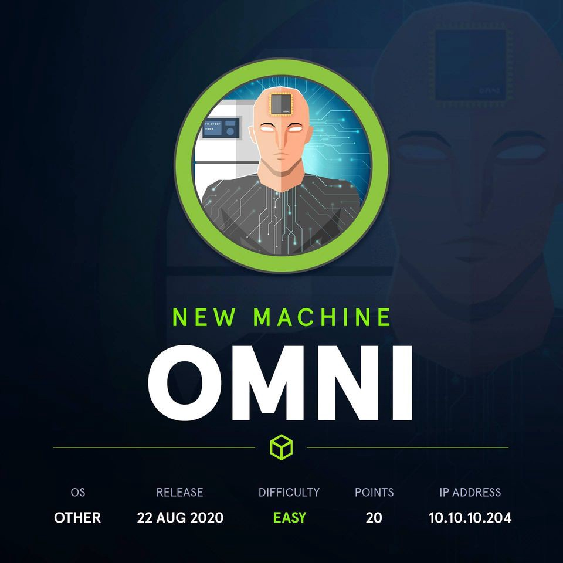
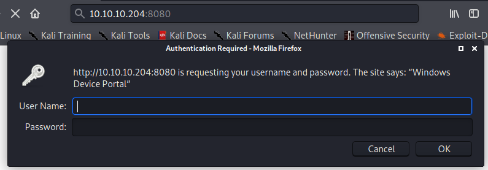
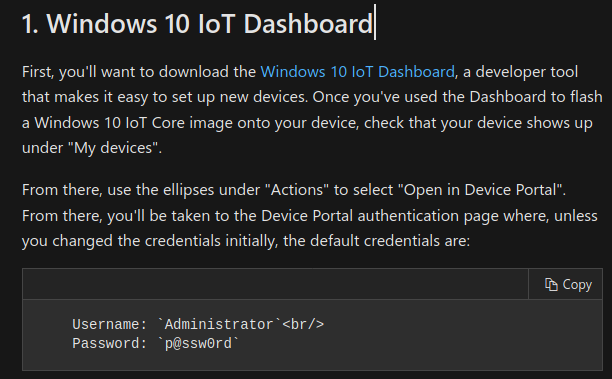
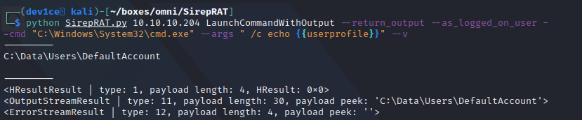
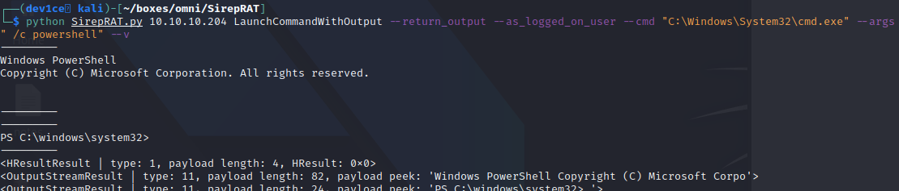
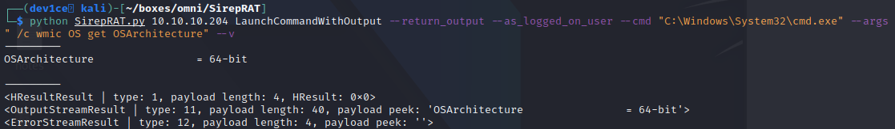
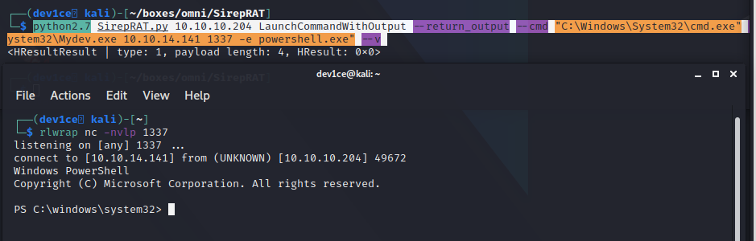
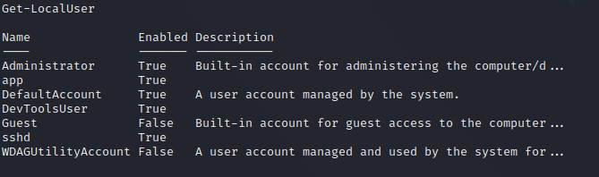
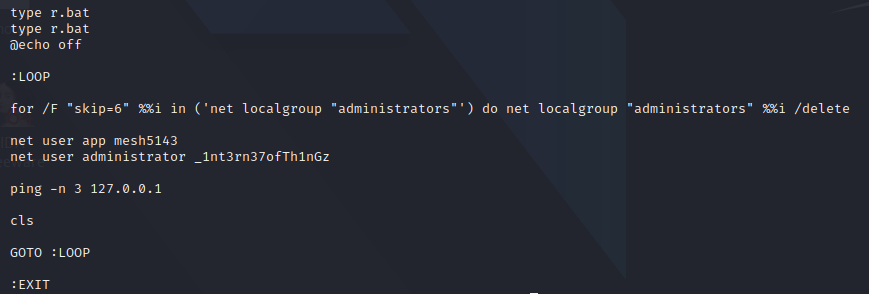

# HTB - Omni

## HTB - Omni

* OS: Windows IoT core
* IP: 10.10.10.204



### Overview

Omni is an easy windows machine that runs windows IoT core which is vulnerable to SirepRat which can execute arbitrary commands remotely. Since we can execute commands on the machine we can get a stable reverse shell. We can't read any flag on the machine because they are encrypted as a PSCredential hash. Enumerating the machine we find a hidden file `r.bat` which has credentials for the web portal of the machine. After we login to `Microsoft device portal` we can execute code from a remote terminal. From here we can get reverse shell for the user and the administrator accounts and we can decrypt the hashes and get the flags.

### Useful tools

1. [SirepRat](https://github.com/SafeBreach-Labs/SirepRAT)

## Enumeration

### Nmap

```bash
Host discovery disabled (-Pn). All addresses will be marked 'up' and scan times will be slower.
Starting Nmap 7.91 ( https://nmap.org/ ) at 2020-11-21 14:11 EET Warning: 10.10.10.204 giving up on port because retransmission cap hit (0).
Nmap scan report for 10.10.10.204
Host is up (0.066s latency).
Not shown: 65529 filtered ports
PORT      STATE  SERVICE VERSION
135/tcp  open    msrpc    Microsoft Windows RPC
5985/tcp open    upnp    Microsoft IIS httpd
8080/tcp open     upnp    Microsoft IIS httpd
| http-auth:
| HTTP/1.1 401 Unauthorized\x0D
|_    Basic realm-Windows Device Portal T
|_http-server-header: Microsoft-HTTPAPI/2.0
|_http-title: Site doesn't have a title.
29817/tcp open unknown
29819/tcp open arcserve ARCserve Discovery
29820/tcp open unknown
1 service unrecognized despite returning data. If you know the service/version, please submit the following fingerprint at https://nmap.org/cgi-bin/submit.cgi?new-service : 
SF-Port29820-TCP:V-7.91%I-7%D-11/21 %Time-5FB90422%P-x86_64-pc-linux-gnu%r( 
SF:NULL, 10,"*LY\xa5\xfb\x04G\xa9m\x1c\xc9}\xc80\x12" )%r (GenericLines,10,
SF:"\LY\xa5\xfb\x04G\xa9m\x1c\xc9}\xc80\x12")%r(Help, 10, "*LY\xa5\xfb'\x 
SF:04G\xa9m\x1c\xc9}\xc80\x12" )%r (JavaRMI, 10, "*LY\xa5\xfb\x046\xa9m\x1c\SF:xc9}\xc80\x12");
Service Info: Host: PING; OS: Windows; CPE: cpe:/o:microsoft:windows

Service detection performed. Please report any incorrect results at https://nmap.org/submit/. 
Nmap done: 1 IP address (1 host up) scanned in 129.29 seconds
```

* At that time it was the first time that I saw ports above 29000 so I looked up those ports and how windows uses them. Searching information about these ports I stumbled across a presentation about IoT security and how SirepRat can be used to exploit such devices running windows IoT core. It also explained that the way users administrate these devices is through the IoT dashboard which is a web interface running on port `29829` using the `Sirep-Server-Protocol2`. The presentation also provided the link for the github repo were SirepRat lives.

  > The above information gathered from [here](https://www.woprsummit.org/slides-archive/SirepRAT_RCEasSYSTEMonWindowsIoTCore-WOPRSummit.pdf)

### Fuzzing the device portal \(HTTP 8080\)



Going through [Microsoft's documentation](https://docs.microsoft.com/en-us/windows/iot-core/manage-your-device/deviceportal) about IoT Dashboard I could find default credentials but the login credentials have been changed by the admin of the IoT dashboard.



## Getting RCE

Since we have a way to run arbitrary commands on the machine with SirepRat we can enumerate the users and upload netcat to get a reverse shell.

### User Enumeration



### Checking powershell access



### Uploading nc64.exe

At first when I tried to upload and execute the default nc.exe that comes with kali I couldn't get a reverse shell. And that's because the OS that runs on the machine can't execute the default nc.exe that is in Kali.



> nc64.exe found here: [https://eternallybored.org/misc/netcat/](https://eternallybored.org/misc/netcat/)

Uploading that version of netcat on the machine and executing it we get a reverse shell



Since we are the omni user in the shell that we have we are basically admin on the box but we can't see neither user's nor administrator's flags because they are encrypted as PSCredentials. In order to decrypt such hashes we have to be logged in the system as the user that created the hash.

## Post exploitation

We can list all the users on the box in powershell using `Get-LocalUser` in powershell.



After more enumeration I found an peculiar `r.dat` file under `C:\Program Files\WindowsPowerShell\Modules\PackageManager` which had credentials for the `app` and `administrator` users.



Using these credentials to login to the device portal on port `8080` we can access the IoT dashboard of both the users.

### Getting access as app & administrator

After logging in as `app` on the IoT dashboard we can see that there is a section called `run command`. Testing the functionality of that section we can see that we can run powershell commands on the machine as the logged in user. So again we upload `nc64.exe` on the box with `powershell IWR` execute it in order to get a reverse shell as the user `app`. !\[\[omni-app.png\]\]

### Decrypting PSCredentials

Now that we are logged in as `app` we can decrypt the user flag. Searching for ways to decrypt PSCredentials I found the way to do so by using these commands:

```text
$rcred = Import-Clixml -path user.txt  
$rcred.GetNetworkCredential().password
```

After executing the above commands in powershell we can read the flag of the user.

* The same process can be implemented  to get access as administrator on the box and decrypt the `root.txt` 

> **More about PSCredentials**  
> [How To Save and Read Sensitive Data with  
> PowerShell](https://mcpmag.com/articles/2017/07/20/save-and-read-sensitive-data-with-powershell.aspx) [Powershell Password Encryption & Decryption](https://www.travisgan.com/2015/06/powershell-password-encryption.html)

